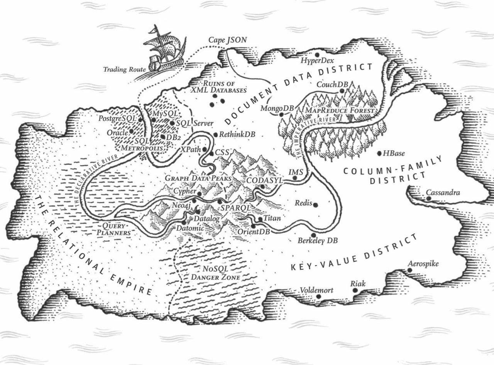

A number of interesting database systems are now associated with the [Base](../OTLP/NoSQL/Base.md) hashtag, and it has been retroactively reinterpreted as *Not Only SQL.*

###### The Object-Relational Mismatch

Most application development today is done in object-oriented programming languages, which leads to a common criticism of the SQL data model: if data is stored in relational tables, an awkward translation layer is required between the objects in the application code and the database model of tables, rows, and columns. The disconnect between the models is sometimes called an ==***impedance mismatch***==.

*For a data structure like a résumé, which is mostly a self-contained document, a JSON representation can be quite appropriate.* 

*The JSON representation has better **==locality==** than the multi-table schema. If you want to fetch a profile in the relational example, you need to either perform multiple queries (query each table by user_id) or perform a messy multi-way join between the users table and its subordinate tables. In the JSON representation, all the relevant information is in one place, and one query is sufficient.*

*The one-to-many relationships from the user profile to the user’s positions, educational history, and contact information imply a tree structure in the data, and the JSON representation makes this tree structure explicit*

###### Many-to-One and Many-to-Many Relationships

Whether you store an ID or a text string is a question of duplication. When you use an ID, the information that is meaningful to humans (such as the word Philanthropy) is stored in only one place, and everything that refers to it uses an ID (which only has meaning within the database). *When you store the text directly, you are duplicating the human-meaningful information in every record that uses it.*

*The advantage of using an ID is that because it has no meaning to humans, it never needs to change: the ID can remain the same, even if the information it identifies changes.* *Anything that is meaningful to humans may need to change sometime in the future — and if that information is duplicated, all the redundant copies need to be updated. That incurs write overheads, and risks inconsistencies (where some copies of the information are updated but others aren’t). Removing such duplication is the key idea behind **==normalization==** in databases*

Unfortunately, ***normalizing this data requires many-to-one relationships*** (many peo‐ ple live in one particular region, many people work in one particular industry), ***which don’t fit nicely into the document model***. In relational databases, it’s normal to refer to rows in other tables by ID, because joins are easy. In document databases, joins are not needed for one-to-many tree structures, and support for joins is often weak.

*If the database itself does not support joins, you have to emulate a join in application code by making multiple queries to the database.*

*Moreover, even if the initial version of an application fits well in a join-free document model, data has a tendency of becoming more interconnected as features are added to applications.*
###### [Hierarchical model](Hierarchical%20model)

It represented all data as a tree of records nested within records, much like the JSON structure. 

The most popular database for business data processing in the 1970s was IBM’s Information Management System (IMS), originally developed for stock-keeping in the Apollo space program and first commercially released in 1968.

Like document databases, IMS worked well for one-to-many relationships, but it made many-to-many relationships difficult, and it didn’t support joins. Developers had to decide whether to duplicate (denormalize) data or to manually resolve references from one record to another.

Various solutions were proposed to solve the limitations of the hierarchical model. The two most prominent were the [Relational Model](Relational%20Model.md) (which became SQL, and took over the world) and the [Network Model](Network%20Model.md) (which initially had a large following but eventually faded into obscurity).

[Quorum](Quorum.md)

# References:

1. [Основы правил проектирования базы данных](https://habr.com/ru/post/514364/)